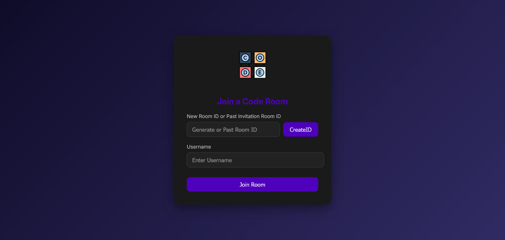
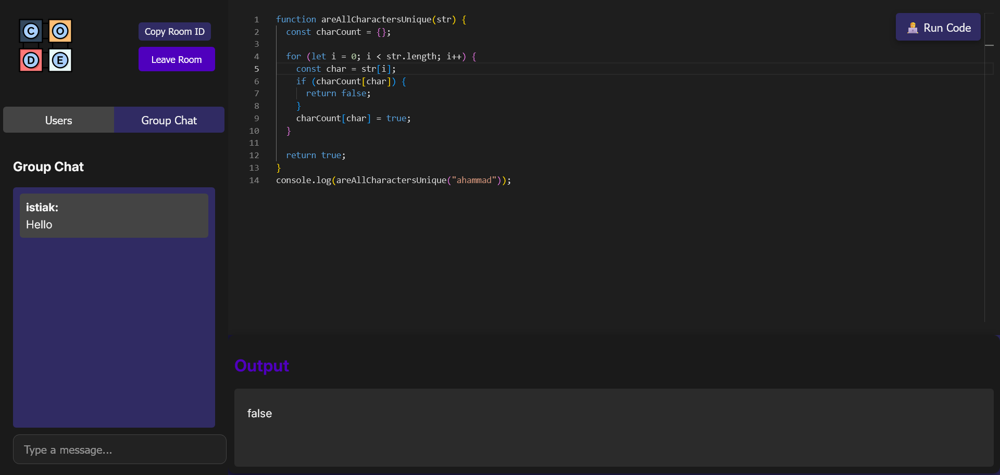

# Real-Time Code Editor

A collaborative real-time code editor using **React**, **Monaco Editor**, **Socket.io**, and **Node.js**. This project enables multiple users to edit the same document simultaneously, with changes updated live.

## Features

- **Collaborative Editing**: Multiple users can work on the same document in real time.
- **Monaco Editor**: The same code editor that powers Visual Studio Code, providing a rich editing experience with syntax highlighting, autocompletion, and more.
- **User Authentication**: Join a session and collaborate by sharing a unique session ID.
- **Real-time Updates**: Powered by Socket.io for seamless and low-latency communication between users.
- **Responsive UI**: Built with **React** for smooth and efficient interaction.

## Tech Stack

- **Frontend**: React.js, Monaco Editor
- **Backend**: Node.js, Express.js, Socket.io
- **Build Tool**: Vite
- **Real-Time Communication**: Socket.io
- **Version Control**: Git, GitHub

